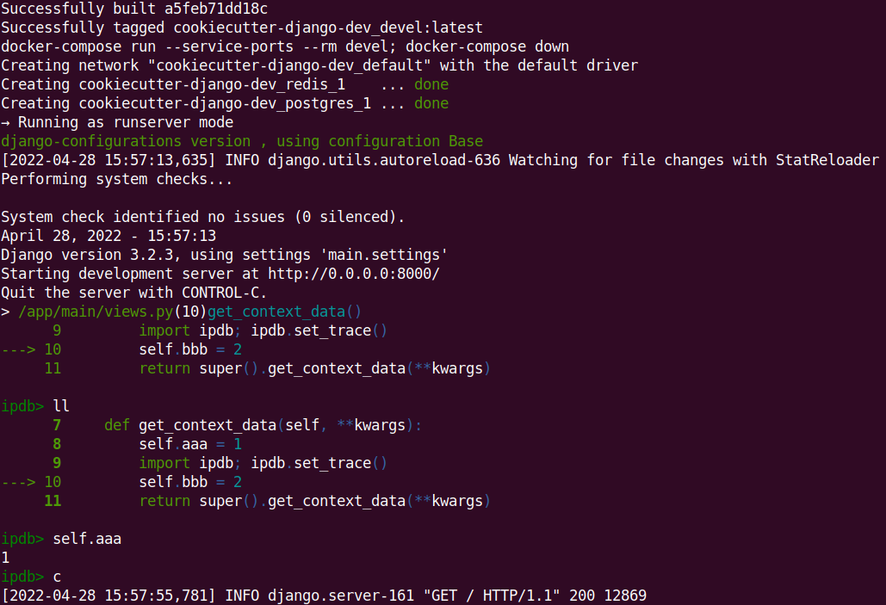
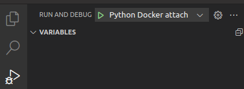
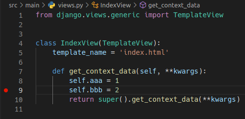
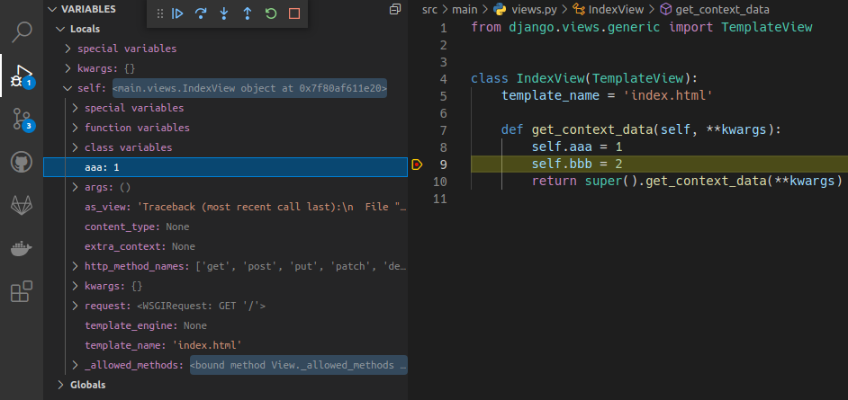
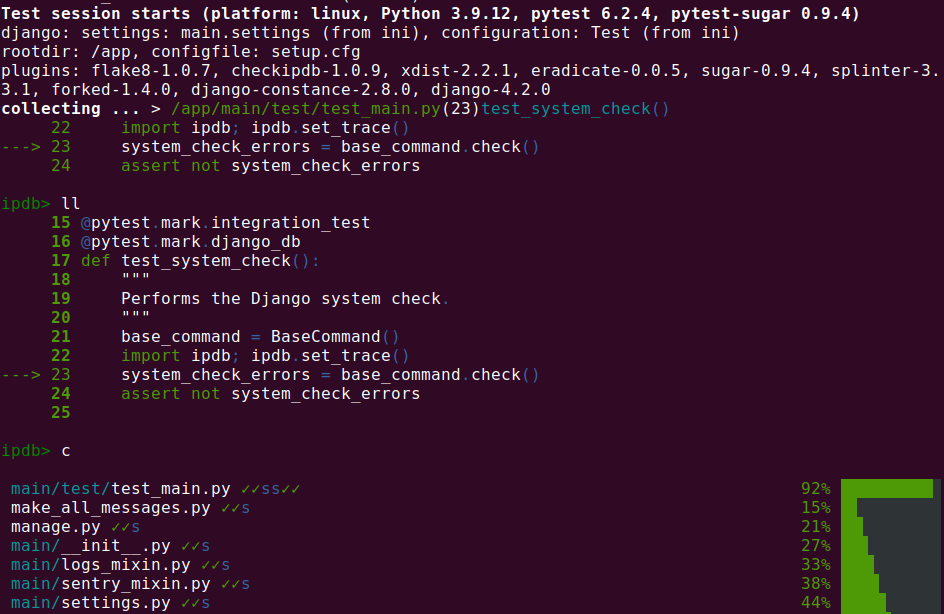
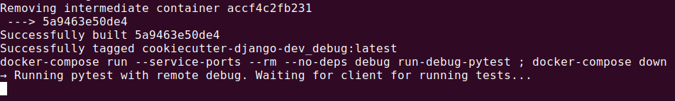

# Docker set-up

This document only explains how to use the features provided by this project with Docker. If you are not familiar
with them, please read the [local installation](local.md) document first (you can skip the
*Running and debugging with and without IDEs* section).


## Initial set-up

1. If it does not exist, create your local configuration [app.ini](../src/app.ini) file and review its contents.
   Take into account that some of its variables are overridden by [env-devel](../env-devel).
    ```sh
    cp src/app.ini.template src/app.ini
    ```
1. If the project does **not** have a  `Pipfile.lock`, create it with:
   ```sh
   make deps c="pipenv install --dev"
   ```
1. Run the migrations
   ```sh
   make command c="python manage.py migrate"
   ```
1. Create a superuser
   ```sh
   make command c="python manage.py createsuperuser"
   ```
1. Create the bucket for medias
   ```sh
   make create_bucket
   ```
1. Start everything in develop mode. You can stop everything with CONTROL-C.
   ```sh
   make devel  # or just "make", devel is the default target.
   ```
   You can execute `docker compose ps` in another shell to see what services and ports are available.


## Common ops

The following commands are not executed in the running container. They build and create a new identical container,
execute the command and shut it down. If a command makes changes to the container environment, like `pipenv`
command, you need to restart the service to see its changes.

* Manage dependencies (pipenv)
  ```sh
  make deps c="pipenv install requests==2.27.1"
  make deps c="pipenv verify"
  ```
* Run any command
  ```sh
  make command c="ls -la"
  ```
* Run a `python manage.py` command
  ```sh
  make command c="python manage.py showmigrations"
  ```
* Run tests
  ```sh
  make command c=pytest
  ```
* Regenerate translations messages
  ```sh
  make command c="./make_all_messages.py"
  ```
* Compile translations messages
  ```sh
  make command c="python manage.py compilemessages"
  ```
* Open a shell inside a container
  ```sh
  make command c=bash
  ```


## More ops

* Open a shell in the running container (either devel or debug):
  ```sh
  make bash
  ```
* Watch logs for running services
  ```sh
  make logs
  ```
* Start Celery worker, Beat and Flower. Only if you execute tasks not in eager mode. Look at
  [Celery local docs](local.md#celery-task-queue) for details.
  ```sh
  make celery
  ```
* If you need something else you can use any `docker` and `docker compose` command
  ```sh
  docker compose ps

            Name                           Command            State                   Ports
  ----------------------------------------------------------------------------------------------------------
  project-container_postgres_1 docker-entrypoint.sh postgres  Up    0.0.0.0:5432->5432/tcp,:::5432->5432/tcp
  project-container_redis_1    docker-entrypoint.sh redis     Up    0.0.0.0:6379->6379/tcp,:::6379->6379/tcp
  ```


# Connecting to services

When you execute `make devel`, needed services are also started with their ports redirected to your localhost. You can
connect to them with your favorite tool using the credentials in [env-devel](../env-devel). Example to connect to
Postgres with *psql*:
```sh
psql -h localhost -p 5432 -d HodlWatcherdb -U uHodlWatcher
```

You can execute `docker compose ps` to see what services and ports are available.


# Debugging with and without IDEs

This project supports remote debugging from the terminal and with [VS Code](https://code.visualstudio.com/).
Unfortunatelly, [PyCharm Community](https://www.jetbrains.com/pycharm/) can not debug dockerized projects, you need the
*Professional* version. Of course, you can use the editor of your choice, but you will need to figure out how to use it
or use the terminal.

VS Code configuration is in [launch.json](../.vscode/launch.json) file.

PyCharm configuration is done using its GUI.


## Debug in the terminal

If you have followed the *Initial set-up* steps and you have the `make devel` running, you are ready to debug in the
terminal using [pdb](https://pymotw.com/3/pdb/index.html) or, even better, [ipdb](https://pypi.org/project/ipdb/):

```python
class IndexView(TemplateView):
    template_name = 'index.html'

    def get_context_data(self, **kwargs):
        self.aaa = 1
        import ipdb; ipdb.set_trace()  # This causes a breakpoint in the execution
        self.bbb = 2
        return super().get_context_data(**kwargs)
```




## Debug with VS Code

To debug inside a Docker container **we can NOT use the `make devel` command**, instead:

* Make sure the *devel* service is not running.
* Start the debug service with `make debug`.
* In VS Code, go to *Run and Debug* in the *Primary Side Bar* and press the green play button at the top for the
  ***Python Docker attach*** entry:

  

* Add a breakpoint clicking on the left side in the line of code in which you want it (the red point is the breakpoint)

  

* Reload the web in the browser and the execution will pause in that point.

  

The key element to enable Python remote debugging is [debugpy](https://github.com/microsoft/debugpy). You can see in
[entrypoint.sh](../docker/entrypoint.sh)'s *run-debug* case that it allows to debug Python code remotely at port 5678.


## Debug with PyCharm (Professional)

* Pycharm Community version can not debug dockerized projects.
* Although we do not support the *Professional* version "officially", it should work. Take a look at the
  [official docs](https://www.jetbrains.com/help/pycharm/using-docker-compose-as-a-remote-interpreter.html) or
  [this other guide](https://testdriven.io/blog/django-debugging-pycharm/) on how to configure it.
* In the [Makefile](../Makefile) you can see what commands are run for every service.


# Testing with and without IDEs

Testing with Docker works very similar to debugging with Docker. You can do it from the terminal, with VS Code and with PyCharm Profsional version, not the Community one.


## Testing in the terminal

As showed in [Common ops](#common-ops) section, you can run and debug tests with any pytest command. Some examples
(there are more examples in the [local tests](local.md#tests) docs):
```sh
make command c=pytest  # run all tests
make command c="pytest -s"  # run all tests stopping on breakpoints
```

```python
@pytest.mark.integration_test
@pytest.mark.django_db
def test_system_check():
    """
    Performs the Django system check.
    """
    base_command = BaseCommand()
    import ipdb; ipdb.set_trace()
    system_check_errors = base_command.check()
    assert not system_check_errors
```



## Testing with VS Code

* Execute ` make debug-pytest`.
* You will see that the container waits for a client to connet before proceeding.

  
* In VS Code, go to *Run and Debug* in the *Primary Side Bar* and press the green play button at the top for the
  ***Python Docker attach*** entry:

  

Tests will run and you will see the output in the terminal and in VS Code as well.

To debug tests, just put a breakpoint in the code with VS Code as explained in the
[Debug with VS Code](#debug-with-vs-code) section and the debugger will stop there.


## Testing with PyCharm (Professional)

* Pycharm Community version can not run neither debug dockerized/remote tests.
* Although we do not support the *Professional* version "officially", it should work. Check the links provided in
  [Debug with PyCharm (Professional)](#debug-with-pycharm-professional) section.
