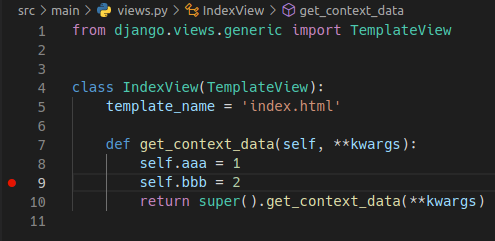

# Local set-up


## Dependencies

Required:
* Python 3.11 [pyenv](https://github.com/pyenv/pyenv) is strongly recommended for installing multiple versions of
  Python.
* [pipenv](https://pipenv.pypa.io).
* [Docker](https://docs.docker.com/get-started/) and [Docker Compose](https://docs.docker.com/compose/install/).
* [Make](https://www.gnu.org/software/make/).
* Postgres dev library (`sudo apt-get install libpq-dev`).


## Installation

1. If it does not exist, create your local configuration [app.ini](../src/app.ini) file and review its contents
    ```sh
    cp src/app.ini.template src/app.ini
    ```
1. Create the Python virtualenv and install dependencies
   * If the project already has a `Pipfile.lock`
     ```sh
     pipenv sync --dev
     pipenv shell
     # Press Ctrl-D to exit the virtualenv.
     ```
   * If the project does **not** have a  `Pipfile.lock`
     ```sh
     pipenv install --dev
     pipenv shell
     # Press Ctrl-D to exit the virtualenv.
     ```
1. Start needed services (Postgres, Redis, MinIO)
    ```sh
    make services_up
    ```
1. Create the bucket for uploading medias
    ```sh
    make create_bucket
    ```
1. Create the database
    ```sh
    cd src
    python manage.py migrate
    # Create a superuser (only the first time the app is run).
    python manage.py createsuperuser
    ```
1. Start the local server
    ```sh
    python manage.py runserver
    # Quit the server with CONTROL-C.
    ```
1. Tests
    ```sh
    pytest
    ```
1. Stop services
    ```sh
    cd ..
    make services_down
    ```

You can also watch service's logs with
```sh
make logs
```

If you prefer to use local services (Postgres, Redis...) instead of the dockerized ones, you can skip the start/stop
services steps and configure *app.ini* file with your local configuration.


# Running and debugging with and without IDEs

This project supports running and debugging from the terminal, with [VS Code](https://code.visualstudio.com/) and
with [PyCharm Community](https://www.jetbrains.com/pycharm/). Of course, you can use the editor of your choice, but
you will need to figure out how to use it or use the terminal.

VS Code configuration is in [launch.json](../.vscode/launch.json) file.

PyCharm configuration is done using its GUI.


## Run and debug in the terminal

If you have followed the *Installation* steps and you have the `runserver` running, you are ready to debug in the
terminal using [pdb](https://pymotw.com/3/pdb/index.html) or, even better, [ipdb](https://pypi.org/project/ipdb/):

```python
class IndexView(TemplateView):
    template_name = 'index.html'

    def get_context_data(self, **kwargs):
        self.aaa = 1
        import ipdb; ipdb.set_trace()  # This causes a breakpoint in the execution
        self.bbb = 2
        return super().get_context_data(**kwargs)
```


## Run with VS Code

* Make sure that services are running with `make services_up`.
* In VS Code, go to *Run and Debug* in the *Primary Side Bar* and press the green play button at the top for the
  ***Django localhost runserver*** entry. It will open a terminal with the application running:

  

  


## Debug with VS Code

* Run the application as explained in the previous section.
* Add a breakpoint clicking on the left side in the line of code in which you want it (the red point is the breakpoint)

  

* Reload the web in the browser and the execution will pause at that point.

  


## Run with PyCharm

* Make sure that services are running with `make services_up`.
* In PyCharm, configure the virtualenv interpreter for the project

  

* Go to *Run > Edit Configurations...* and create a new Python run/debug configuration like this:

  

* You can run the application clicking the *play* button at the top right corner. It will open a terminal with the
  application running:

  

  


## Debug with PyCharm

* Configure the virtualenv interpreter and the run/debug configuration as explained in the previous section.
* Add a breakpoint clicking on the left side in the line of code in which you want it (the red point is the breakpoint)

  

* Run the application in debug mode pressing the *bug* button at the top right corner:

  

* Reload the web in the browser and the execution will pause at that point.

  


# Functionality

Most of the configuration functionality can be deduced by reading *app.ini* and *settings.py* files.
The main sections are explained in more detail bellow.


## Python virtual environments, packages and dependencies

This project uses **[pipenv](https://pipenv.pypa.io)** to handle Python package dependencies and virtual
environments.

The list of the application dependencies is stored in two separate files, **Pipfile** y **Pipfile.lock**:
* **Pipfile** is updated automatically when new packages are added, removed or updated in the environment.
* **Pipfile.lock** contains the exact fixed (hashed) version of every package that is installed. This provides
  reproducibility and [security](https://docs.pipenv.org/en/latest/advanced.html#pipfile-lock-security-features).
  You should never edit this file manually.

**Pipenv cheatsheet**

* Install all dependencies, including development ones, from *Pipfile.lock* and create the virtualenv if necessary:
  ```sh
  pipenv sync --dev
  ```
* Open a shell in the virtualenv:
  ```sh
  pipenv shell
  # Press Ctrl-D to exit the virtualenv.
  ```
* Install all dependencies, including development ones, create or update the *Pipfile.lock* and create the virtualenv
  if necessary:
  ```sh
  pipenv install --dev
  ```
* Install a new package (i.e. *requests*) and add it to *Pipfile* and *Pipfile.lock*:
  ```sh
  pipenv install requests==2.27.1
  ```
* Update a package to the latest version:
  ```sh
  pipenv update requests
  ```
* Uninstall a package:
  ```sh
  pipenv uninstall requests
  ```

It is convenient to check all packages to find out if security fixes have been released for the versions we include on
Pipfile. The recommended tool to verify if installed packages are safe is [safety](https://pyup.io/safety).


## Media uploads with MinIO

Medias (user uploaded files) are handled by the [MinIO](https://min.io/) storage service in development. MinIO acts as
a local replacement for AWS S3, mimicking its API. It can be use with `Boto3` and `Django Storages`.

Once you run `make services_up`, MinIO Console web is available at http://localhost:9001 and you can log in using
`MINIO_ROOT_USER` and `MINIO_ROOT_PASSWORD` envvars in [end-devel](../env-devel).

By default the bucket is private so file's URLs will be have the querystring auth parameters and an expiration date.
You can change this with
[AWS_QUERYSTRING_AUTH and AWS_DEFAULT_ACL settings](https://github.com/APSL/django-kaio/blob/master/kaio/mixins/storage.py#L56-L62).
For more options read [django-storages docs](https://django-storages.readthedocs.io/en/latest/backends/amazon-S3.html).


## Sass

By default, the project is configured with support for [Sass](https://sass-lang.com/) using the standalone binary
in the `/bin` directory.

To use it in static files you must use `type="text/scss"` or `type="text/sass"`. Example:
  ```django
  <link type="text/scss" rel="stylesheet" href="">
  ```


## Testing static files, offline compress and 404 without DEBUG mode

The project includes the [WhiteNoise](https://whitenoise.evans.io/) server that allows serving static files when not on
DEBUG mode. To use it, follow these steps:

1.  Modify the *app.ini* file
    ```ini
    DEBUG = False
    COMPRESS_ENABLED = True
    COMPRESS_OFFLINE = True
    ENABLE_WHITENOISE = True
    ```
1.  Build static files offline (the order of the commands below is important)
    ```sh
    python manage.py compress
    python manage.py collectstatic
    ```
1.  Start the application server
    ```sh
    python manage.py runserver
    ```

On http://localhost:8000 you will be able to see the page with the compressed static files.
When a non-existing page is opened, the 404 page will also be shown with the compressed static files.

**Performing this step before deploying to Production environments is a must. This validates that both generating and
loading offline static files works.**


## Tests

The project is ready to run tests using [pytest](https://docs.pytest.org/).

It will also validate the code against [Flake8](https://flake8.pycqa.org/) and [mypy](https://mypy.readthedocs.io)
and will throw errors if types or basic Flake8 rules are not followed.

The configuration for pytest and flake8 can be found in [pyproject.toml](../src/pyproject.toml).

The project includes some basic example tests in [tests_main.py](../src/main/test/test_main.py).

Test command examples:
*  `pytest` to run all tests in the application.
*  `pytest -s` to run all tests in the aplication. The process will stop on breakpoints.
*  `pytest -m unit_test` to run only unit tests.
*  `pytest -m integration_test` to run only integration tests (API usage, accessing databases...).
*  `pytest -m functional_test` to run only functional tests (this runs in a browser window).
*  `pytest -m "not functional_test"` to run all tests, except functional ones.
*  `pytest --markers` to list all markers.

`unit_test`, `integration_test` and `functional_test` are
[markers](https://doc.pytest.org/en/latest/example/markers.html) that are defined in *pyproject.toml* and are
used in tests.


### Testing in VS Code

Similar to [Run with VS Code](#run-with-vs-code), go to *Run and Debug* in the *Primary Side Bar* and press the green
play button at the top for the ***Pytest localhost*** entry. It will open a terminal with tests running:


You can also debug tests adding breakpoints like in [Debug with VS Code](#debug-with-vs-code).


### Testing in PyCharm

Similar to [Run with PyCharm](#run-with-pycharm), you can define a *Run/Debug Configuration* like this one


and run or debug the tests using the *play* or *bug* buttons:


### Testing database and settings

The default database for testing is an in-memory [SQLite](https://sqlite.org/). This is the simplest and fastest
option.

If you need features from a Postgres database, the *app.ini* file contains a commented section to allow to configure
a Postgres in memory testing database:
  ```ini
  TEST_DATABASE_USER      = user
  TEST_DATABASE_ENGINE    = postgresql
  TEST_DATABASE_HOST      = canape.user.net
  TEST_DATABASE_NAME      = HodlWatcher_test_db
  TEST_DATABASE_PORT      = 5434
  TEST_DATABASE_PASSWORD  = 1234
  ```

When SQLite is not used for tests, the *pyproject.toml* file indicates that the database is reused every time we run the
tests. This means that the database is not destroyed after running every test and it doesn't run migrations
(it performs an autoinspect of the models in order to create the database for the first time).

If the database or any other setting requires special properties that cannot be configured via *app.ini*, the `Test`
class that can be found at the bottom of [settings.py](../src/main//settings.py). This class allows to overwrite the
configuration for tests.


### flake8 and flake8-django

As mentioned before, flake8 is used to validate the [PEP8](https://pep8.org/) rules. On top of that, a plugin called
[flake8-django](https://github.com/rocioar/flake8-django) is installed and integrated with pytest.

For example, assuming there is a model that has a `CharField` defined as follows:

```python
class InputChannel(models.Model):
    description = models.CharField(max_length=40, null=True)
```

A warning will be produced:
```
――――――――――――――――――――――――――――――――――――――――― FLAKE8-check ―――――――――――――――――――――――――――――――――――――――――
/home/marc/workspace/iris/iris2/src/iris_masters/models.py:105:19: DJ01 null=True not recommended to be used in CharField
```

Specific flake8 checks can be disabled if needed. To do so, you need to modify 2 files:

* [.flake8](../src/.flake8) : used whe flake8 is executed stand-alone.
  ```ini
  [flake8]
  extend-ignore = E203,E501,E116,DJ01
  ```
* [pyproject.toml](../src/pyproject.toml) : used whe flake8 is executed within pytest.
  ```toml
  [tool.pytest.ini_options]
  # ...
  flake8-extend-ignore = ["E203", "E501", "E116", "DJ01"]
  ```


### Black

[Black](https://black.readthedocs.io/) is a Python code formatter. It is already configured and integrated with
pytest and CI, so you need to pass it to be able to deploy the project. Its configuration is in the
[pyproject.toml](../src/pyproject.toml) file.

After running `pytest`, if you have `black` errors you can run it stand-alone to see the problems better:
```
.../src $ black --check --diff .
would reformat main/storages.py
--- main/management/commands/test.py	2022-12-14 10:37:37.734817 +0000
+++ main/management/commands/test.py	2022-12-14 11:27:41.573668 +0000
@@ -3,30 +3,34 @@

 class Command(BaseCommand):
     help = 'Do not allow to execute "./manage.py test"'

     def add_arguments(self, parser):
-        parser.add_argument('-g', '--goku', dest='goku', action='store_true',
-                            help='Kamehamehaaaaaaa!!')
+        parser.add_argument("-g", "--goku", dest="goku", action="store_true", help="Kamehamehaaaaaaa!!")

# ...

Oh no! 💥 💔 💥
14 files would be reformatted, 4 files would be left unchanged.
```

For fixing problems automatically, just run:
```
.../src $ black .
# ...
reformatted main/management/commands/test.py

All done! ✨ 🍰 ✨
14 files reformatted.
```

**TIP**: The best way to use `black` (and all the other linters and tools) is to have it
[integrated in your IDE](https://black.readthedocs.io/en/stable/integrations/editors.html).


### mypy

This project has already configured the [mypy](https://mypy.readthedocs.io) static type checker. It's integrated
with pytest so it will be run every time you run the tests. Its configuration is in the different mypy* sections
in the *pyproject.toml* file.

Example of output when there is an error:
```
============================================= mypy =============================================
type "TextField[Union[str, Combinable], str]", variable has type "str")
[assignment]
        name: str = models.TextField('table', max_length=100)
                    ^~~~~~~~~~~~~~~~~~~~~~~~~~~~~~~~~~~~~~~~~
type "str", base class "ModelAdmin" defined the type as
"Union[List[Union[str, Callable[[Any], str]]], Tuple[Union[str, Callable[[Any], str]], ...], Tuple[]]")
 [assignment]
        list_display: str = ('name',)
                            ^~~~~~~~~
Found 2 errors in 2 files (checked 22 source files)
```

Unfortunately, `pytest` and `mypy` integration is not 100% perfect and we can not see which file each error belongs
to. For a better error message, you can execute `mypy` directly from the shell:
```
.../src $ mypy .
lorem/models.py:5:17: error: Incompatible types in assignment (expression has type "TextField[Union[str, Combinable], str]", variable has type "str")  [assignment]
        name: str = models.TextField('table', max_length=100)
                    ^~~~~~~~~~~~~~~~~~~~~~~~~~~~~~~~~~~~~~~~~
lorem/admin.py:8:25: error: Incompatible types in assignment (expression has type "str", base class "ModelAdmin" defined the type as
"Union[List[Union[str, Callable[[Any], str]]], Tuple[Union[str, Callable[[Any], str]], ...], Tuple[]]")  [assignment]
        list_display: str = ('name',)
                            ^~~~~~~~~
Found 2 errors in 2 files (checked 22 source files)
```

`mypy` supports all Python stdlib out of the box. In addition, django and celery type stubs are already installed.
If you need to use more libraries that are not typed, you need to Pipenv install its type stubs. 2 possible candidates are:
* [Django Rest Framework stubs](https://github.com/typeddjango/djangorestframework-stubs)
* [requests stubs](https://pypi.org/project/types-requests/).

More info at https://mypy.readthedocs.io/en/stable/running_mypy.html#missing-library-stubs-or-py-typed-marker


### Test database

By default, the project uses an in-memory SQLite database for tests. This is the simplest and fastest way to run
tests. If you need a Postgres database for tests, first try to keep using SQLite:

* If you use [Geodjango](https://docs.djangoproject.com/en/3.2/ref/contrib/gis/), try
  [using `SpatiaLite` instead of `Postgis` for tests](https://docs.djangoproject.com/en/3.2/ref/contrib/gis/install/#spatial-database).
* Try to mock the specific features that requires a different database using libraries like
  [model-bakery](https://model-bakery.readthedocs.io/).

If you definitively need a Postgres database for tests, you can use the `TEST_DATABASE_XXX` settings to point to
a different one. Take into account that you probably need to make modifications in multiple config files
(app.ini, env-devel, env-uwsgi, docker-compose.yml, etc.) to be sure that it works in:

* Local environments without docker.
* Local environments with docker.
* GitlabCI Pipelines.


## Security

The project comes with two security scanner tools, one for Python code and one for vulnerability and misconfiguration.


### Bandit

[Bandit](https://bandit.readthedocs.io/) is a tool for finding common security issues in Python code.
It is one of the `test` steps in the CI pipeline, so you need to pass it to be able to deploy the project.

Its integration with `pytest` is in [bad shape](https://github.com/Wanderu/pytest-bandit/issues) so you need
execute it stand-alone:

```
.../src $ bandit -c pyproject.toml -r .
[main]	INFO	Found project level .bandit file: ./.bandit
[main]	INFO	Using command line arg for selected targets
[main]	INFO	profile include tests: None
[main]	INFO	profile exclude tests: None
[main]	INFO	cli include tests: None
[main]	INFO	cli exclude tests: None
[main]	INFO	running on Python 3.8.10
[tester]	WARNING	nosec encountered (B108), but no failed test on line 156
Run started:2022-12-12 14:30:03.461206

Test results:
>> Issue: [B605:start_process_with_a_shell] Starting a process with a shell, possible injection detected, security issue.
   Severity: High   Confidence: High
   CWE: CWE-78 (https://cwe.mitre.org/data/definitions/78.html)
   Location: ./make_all_messages.py:22:12
   More Info: https://bandit.readthedocs.io/en/1.7.4/plugins/b605_start_process_with_a_shell.html
21	            print(entry)
22	            os.system(f'python ..{os.path.sep}manage.py makemessages -a')
23	        os.chdir(f'..{os.path.sep}')

--------------------------------------------------

Code scanned:
	Total lines of code: 284
	Total lines skipped (#nosec): 0

Run metrics:
	Total issues (by severity):
		Undefined: 0
		Low: 0
		Medium: 0
		High: 1
	Total issues (by confidence):
		Undefined: 0
		Low: 0
		Medium: 0
		High: 1
Files skipped (0):
```

Bandit's configuration is in [pyproject.toml](../src/pyproject.toml) file.

You can also execute it from VSCode running the `Bandit localhost` configuration and from PyCharm
creating a `Run/Debug Configuration` like it's explained in the previous
[Testing in PyCharm](#testing-in-pycharm) section.


### Trivy

[Trivy](https://trivy.dev/) is the world’s most popular open source vulnerability and misconfiguration scanner.

It is part of the `test` CI pipeline but currently it's only an informative step. You can also run it locally
with a simple `make` command:

```
$ make trivy
docker compose run --rm trivy

Pipfile.lock (pipenv)
=====================
Total: 12 (HIGH: 8, CRITICAL: 4)

+---------+------------------+----------+-------------------+-----------------------+---------------------------------------+
| LIBRARY | VULNERABILITY ID | SEVERITY | INSTALLED VERSION |     FIXED VERSION     |               TITLE                   |
+---------+------------------+----------+-------------------+-----------------------+---------------------------------------+
| django  | CVE-2021-35042   | CRITICAL | 3.2.3             | 3.1.13, 3.2.5         | django: potential SQL injection via   |
|         |                  |          |                   |                       | unsanitized QuerySet.order_by() input |
|         |                  |          |                   |                       | -->avd.aquasec.com/nvd/cve-2021-35042 |
+         +------------------+          +                   +-----------------------+---------------------------------------+
|         | CVE-2022-28346   |          |                   | 2.2.28, 3.2.13, 4.0.4 | Django: SQL injection in              |
|         |                  |          |                   |                       | QuerySet.annotate(),aggregate()       |
|         |                  |          |                   |                       | and extra()                           |
|         |                  |          |                   |                       | -->avd.aquasec.com/nvd/cve-2022-28346 |
+         +------------------+          +                   +                       +---------------------------------------+
|         | CVE-2022-28347   |          |                   |                       | Django: SQL injection via             |
|         |                  |          |                   |                       | QuerySet.explain(options)             |
|         |                  |          |                   |                       | on PostgreSQL                         |
|         |                  |          |                   |                       | -->avd.aquasec.com/nvd/cve-2022-28347 |
# ...
```

## Celery task queue

Background tasks are managed with [Celery](https://docs.celeryq.dev/) using Redis as a broker.

By default, during developmet all tasks are always executed in
[eager mode](https://docs.celeryq.dev/en/stable/userguide/configuration.html#task-always-eager),
that is, tasks will be executed locally instead of being sent to the queue. This way you can run and debug the code
as usual without additional commands, as explained in
[previous sections](#running-and-debugging-with-and-without-ides).


### Periodic tasks

If you need to execute tasks periodically **don't use Cron, use
[Celery Beat](https://docs.celeryq.dev/en/stable/userguide/periodic-tasks.html)**. You can manage tasks in
`/admin/django_celery_beat/`. You will need to run a real worker and the beat service to check that it works.


### Using real queues and workers

If you need to check that tasks are sent to the queue, workers consume them and the Beat service creates everything well, you need to:

1. Deactivate the eager mode changing `CELERY_ALWAYS_EAGER` from `True` to `False` in [app.ini](../src/app.ini).
1. Start a worker and the Beat service in the `src` directory in the virtual environment.
   ```sh
   # Option 1: worker and Beat in different processes (shells):
   celery -A main.celery worker -l info
   celery -A main.celery beat -l info

   # Option 2: worker and Beat in the same process
   celery -A main.celery worker -l info -B
   ```
1. Optionally, you can use the [Flower](https://flower.readthedocs.io/) monitoring tool at http://localhost:5555.
   ```sh
   celery -A main.celery flower
   ```

You will see the logs in the terminal and the executed tasks results in `/admin/django_celery_results/taskresult/`.
These results are saved in the database and will be deleted after 1 week by the `celery.backend_cleanup` task. The
clean period can be changed modifying the `CELERY_RESULT_EXPIRES` settings.

### Debugging tasks

The easiest way to debug your tasks code is to execute them in eager and use the normal flow explained in
[previous sections](#running-and-debugging-with-and-without-ides).

In case you really need to debug using real queues and workers, have a look at the Celery
[debugging docs](https://docs.celeryq.dev/en/stable/userguide/debugging.html).

## Emails

Django Yubin is already installed and configured to save emails in the database by default. Look at the
[docs](https://django-yubin.readthedocs.io/) if you wan to save them in a diferent storage. Before deploying
the project, it is necessary to review the sending email addresses to make sure it is configured and to avoid
spam block issues.


## Translations

* Generate/update all translatable message files (check the file itself for details):
  ```bash
  # cd src
  ./make_all_messages.py
  ```
* Compile all message files:
  ```bash
  python manage.py compilemessages
  ```


## Healthcheck

*django-health-check* is used for health checks and status. This library allows us to obtain information in json and
html formats and we can also run our own healthchecks by overwriting the library classes. By default, most common and
basic checks are included (database, cache...).

The cache healthcheck requires a correctly configured cache system. In the *app.ini* file the redis cache system is
already pre-configured by default.

You can see the checks in http://localhost:8000/health.


## robots.txt

The project is configured so that the entire website can be indexed. This behaviour can be changed in
http://localhost:8000/admin/robots/.


## Cookie Law

This project does not include any cookie or privacy banner. If you need to add one, take a look at
https://gitlab.apsl.net/apsl/privacy.


# Other tips


## Connecting to services

When you execute `make services_up`, these services have their ports redirected to your localhost. You can connect to
them with your favorite tool using the credentials in the *app.ini* file. Example to connect to Postgres with *psql*:
```sh
psql -h localhost -p 5432 -d HodlWatcherdb -U uHodlWatcher
```

You can execute `docker compose ps` to see what services and ports are available.


## Data in Docker volumes

Postgres and MinIO dockerized services use [docker volumes](https://docs.docker.com/engine/storage/volumes) to persist
data. These volumes are created automatically but not deleted. See the official docs to
[list](https://docs.docker.com/engine/storage/volumes/#create-and-manage-volumes),
[backup, restore](https://docs.docker.com/engine/storage/volumes/#back-up-restore-or-migrate-data-volumes) or
[remove](https://docs.docker.com/engine/storage/volumes/#remove-volumes) them.

## Migrations

If running migrations with `python manage.py migrate` takes a long time, we must check if we can optimise migrations
by performing [squash migrations](https://docs.djangoproject.com/en/3.2/topics/migrations/#squashing-migrations). If
this is not possible for whatever reason, we may use an experimental library called
[django-fast-migrations](https://github.com/APSL/django-fast-migrations) that runs migrations one application at a
time, and results in a faster execution.

As stated on their documentation, we will need to do the following:

* Install the package with `pipenv install django-fast-migrations`.
* Add `django_fast_migrations` to `INSTALLED_APPS` on `settings.py`.
* Execute `python manage.py migrate_by_app --execute`


## Rotate SECRET_KEY

If you need to [rotate the secret key on production](https://medium.com/@bayraktar.eralp/changing-rotating-django-secret-key-without-logging-users-out-804a29d3ea65)
transparent to users following best security practices,
[this library](https://github.com/EralpB/django-rotate-secret-key) can help you.
